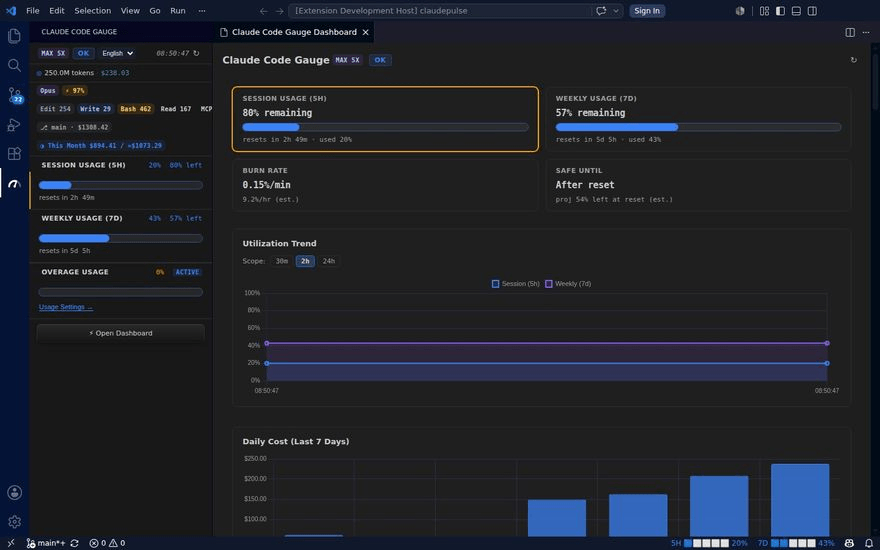

# Claude Code Gauge

> Real-time Claude Max rate limit monitor — right inside VS Code & Cursor.

Stop switching to your browser to check Claude rate limits. See your **5-hour session**, **7-day weekly usage**, **today's token cost**, **what Claude actually did**, **which skill & branch cost how much**, and **how much your subagents spend** — with burn rate predictions, tool usage breakdowns, per-skill cost attribution, and Git branch ROI — without leaving your editor.

## What's New in v0.1.43

- **New: Usage Calendar.** A GitHub-style contribution heatmap of your daily Claude Code cost, right below the Daily Cost card — hover any day for its cost/tokens, with a highlighted "today" cell. History now backfills in full on every refresh, so the calendar (and other history charts) fill in from day one instead of growing one day at a time.
- **Security: hardened `credentialsPath` against workspace-level hijacking.** A malicious repo's `.vscode/settings.json` could previously point this setting at an arbitrary file; it's now locked to your user/global settings only (VS Code enforces this at the platform level, plus a code-level fallback).

## Features

### Rate Limit Monitor (API headers)
- **StatusBar**: Two independent items — `5H 🟦🟦⬜⬜⬜ 28%` and `7D 🟦⬜⬜⬜⬜ 14%` — emoji fill count based on utilization %; color (🟦🟨🟥), background, and font based on utilization thresholds (0–80 % blue · 80–90 % amber · 90–<100 % red Danger · 100 % red Blocked)
- **Sidebar**: Three labeled sections — **Session (5h)** · **Weekly (7d)** · **Overage** — each with `used% · left%` display + status-colored progress bars (blue OK / amber Warning / red Danger·Blocked) + overall status badge inline with title
- **Plan badge**: Your subscription tier (e.g. `Max 5x`) shown in the header — read from local credentials, no extra API call
- **Burn Rate**: `%/min` consumption speed — estimated from session elapsed time on first open, then refined from poll history
- **Safe Until**: Predicted time when your 5h quota runs out at current burn rate
- **Dashboard Panel**: SESSION · WEEKLY · BURN RATE · SAFE UNTIL 4-card layout + utilization trend chart
- **Trend Chart Scope**: Toggle 30m / 2h / 24h view window directly on the chart
- **Bottleneck highlight**: The currently limiting window (5h or 7d) is outlined in amber so you instantly see what's constraining you
- **Overage section**: Progress bar + status chip for your overage (extra usage) quota — shows the overage rate-limit utilization **only when active** (amber), and a `DISABLED` chip when overage is rejected/disabled instead of a misleading "0%". A help tooltip clarifies this is the overage *rate-limit* usage (consumed after your base 5h/7d quota is exhausted), distinct from the claude.ai "Usage Credits" dollar-spend figure
- **Fallback banner**: Inline warning when Claude throttles to reduced speed (e.g. 50%)
- **7d threshold badge**: Red badge on the Weekly card when a usage threshold has been surpassed
- **Threshold alerts**: Native VS Code warning notification when usage exceeds your configured limit
- **Auto-polling**: Fetches latest rate limit headers from Anthropic API every 5 minutes

### Token & Cost Analytics (local `.jsonl`)
- **Today's usage**: Sidebar shows "N tokens · ~$X.XX" — parsed directly from `~/.claude/projects/**/*.jsonl`, no API call
- **Model chip**: Color-coded Fable / Opus / Sonnet / Haiku chip showing today's primary model in the sidebar
- **Cache hit rate chip**: Today's cache hit rate (e.g. `⚡ 72%`) with saved cost in tooltip — pure local calculation
- **7-day cost bar chart**: Dashboard panel shows daily spend for the past 7 days
- **Model breakdown**: Doughnut chart + bar list showing per-model cost share for today
- **Cache efficiency**: Hit rate KPI, cumulative saved cost, and 7-day sparkline in the dashboard
- **Session history**: Up to 20 recent sessions with start time, working directory, token count, and estimated cost
- **LiteLLM pricing**: Offline cost calculation using embedded model price snapshot (fable-5 / opus-4.5–4.8 / sonnet-4.5–4.6 / haiku-4.5, with legacy fallbacks)

### Language Support
- **4-language UI**: Switch between 한국어 / English / 日本語 / 中文 via the compact dropdown in the sidebar header — all labels, section names, error messages, and burn-rate strings update instantly
- **Full dashboard translation**: Dashboard panel section headers, metric labels, chart titles, and empty states are all translated
- **Real-time sync**: Changing language in the sidebar instantly updates the dashboard panel without reopening — broadcast via extension messaging
- **Auto-detection**: Defaults to your system language (`navigator.language`) on first install; persists your choice across sessions via extension `globalState`

### Sidebar Navigation
- **Open Dashboard button**: Persistent button at the bottom of the sidebar — tactile depth styling with gradient and press effect — opens the full Dashboard Panel in one click

### Action Insights — *what Claude did* (local `.jsonl`)
- **Tool usage chips** (sidebar): `Edit N · Write N · Bash N · Read N · Grep N · 🔍 N · 🌐 N · MCP N` — today's tool call counts at a glance, with `Read`, `Grep`/`Glob`, `WebFetch`, and `MCP` (`mcp__*`) broken out from the old catch-all bucket
- **Tool usage histogram** (dashboard): Stacked bar chart of Edit / Write / Bash / Search per day for the last 7 days — spot heavy editing vs. execution sessions
- **Recently edited files** (dashboard): Up to 20 files touched in recent sessions, ordered by last activity — filename + full path

### Cost Attribution — *where the cost went* (local `.jsonl`)
- **Cost by Skill** (dashboard): Ranked bar list of cost per `attributionSkill` (sh-dev-loop, ship, plan, research, …) — see which Claude Code skills drive your spend. Because Claude Code only stamps a skill on main-chain turns *while a skill is actively loaded* (~⅓ of cost-bearing turns), everything else — plain requests and work before/after a skill loads — is shown as a first-class **"Outside skills"** bucket rather than hidden, with a `≈ Partial` badge. Subagent-delegated cost is surfaced separately below
- **Subagent vs. main split** (dashboard): Subagent consumption share, cost, and unique-agent count from `isSidechain`/`agentId` — separate background subagent usage from your main session

### Long-term Cost Tracking (local persistence)
- **CacheStore**: Daily usage snapshots persist to `globalStorageUri/ccg-history.json` — survives jsonl rotation so history accumulates across months
- **Long-term trend chart** (dashboard): Daily cost line chart with 30d / 90d / 180d scope toggle — see spending patterns across months
- **Monthly cost bar chart** (dashboard): Month-by-month cost aggregation — spot your most expensive periods
- **This-month chip** (sidebar): `◑ This month $X.XX / ≈$Y.YY` — current month spend + projected end-of-month cost (linear extrapolation)

### Git Branch ROI (local `.jsonl`)
- **Branch cost chip** (sidebar): `⎇ main · $0.42` chip showing the active branch and its cumulative cost — parsed directly from `gitBranch` field in every jsonl entry, no Git API dependency
- **Git ROI table** (dashboard): Full branch breakdown — **Branch · Cost · Tokens · Sessions · Last Active** — sorted by cost so your most expensive branches surface first
- **Cost by Commit — usage×git retrospective** (dashboard): Extends branch ROI down to individual commits. Because git commits aren't recorded in session logs, cost is *approximately* attributed by `timestamp + cwd + branch` — so the card is explicit about it: an **`≈ Approximate`** badge, per-commit confidence dots, and a first-class **"Other / Uncommitted"** bucket (planning/research/debugging that hasn't been committed yet) instead of hiding it. Attributions persist SHA-keyed so they outlive the 30-day log window.
