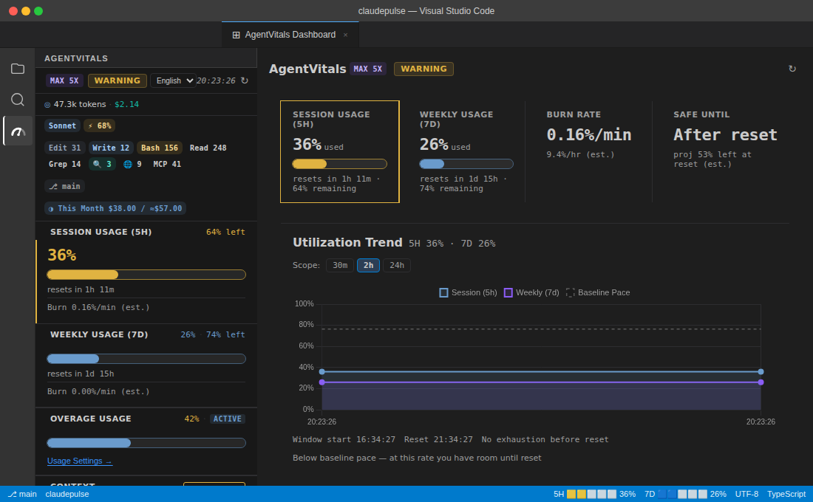
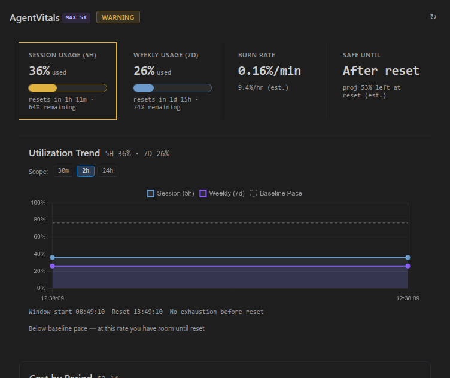

# Claude Code Gauge

> Real-time Claude Max rate limit monitor — right inside VS Code & Cursor.

Stop switching to your browser to check Claude rate limits. See your **5-hour session**, **7-day weekly usage**, **today's token cost**, **what Claude actually did**, **which skill & branch cost how much**, and **how much your subagents spend** — with burn rate predictions, tool usage breakdowns, per-skill cost attribution, and Git branch ROI — without leaving your editor.

## What's New in v0.1.54

- **Fixed: a handful of error messages shown in the sidebar/panel weren't HTML-escaped before being displayed.** If the webview's messaging layer ever failed to start, its error text was inserted into the page without escaping first — a defensive hardening fix, not a reported exploit. (Completed as v0.1.53, which was never published on its own; it reaches you here.)
- Everything else in v0.1.54 is internal and changes nothing you can see: unit-test coverage for the usage-rollup, cache and workspace-mapping services that had none; type checking turned on for the webview and test code, which had been silently excluded; an off-the-event-loop fix for a directory scan that ran on every refresh; and the 1882-line webview entry point split into four modules, checked against a structural snapshot of the rendered UI across both surfaces, two widths and two languages to confirm nothing moved.

v0.1.52

- **Fixed: the Usage Calendar's month labels no longer drift away from the days they label.** On a wide dashboard the heatmap's day cells stretched to fill the card while the month labels stayed put, so the labels ended up describing the wrong weeks — by as much as 704px on a 1600px-wide window, which made your most recent activity look like it belonged to a month far in the future. The calendar is now fixed-width on both the dashboard and the sidebar: cells stay the same size no matter how wide the panel gets, and the leftover space is simply left empty, the way contribution graphs normally work. If the panel is *narrower* than the calendar, it scrolls sideways as before.
- **Fixed: month labels in Korean, Japanese and Chinese no longer break across two lines and overlap the top row of cells.** The labels now stay on one line in every language, and English labels ("Aug", "Sep") no longer nudge the spacing out of alignment either.

v0.1.51

- **Fixed: in a multi-root workspace, the context gauge could sit on a repo you weren't working in.** The gauge only ever looked at the workspace's *first* folder — a limitation v0.1.48 shipped knowingly. In practice that meant opening three repos in one window, working in one of them, and watching the gauge report a different repo's session from a day and a half ago. It now considers every folder open in the window and shows the most recently active session among them.
- **New: pick which session the gauge tracks.** Click the `📁` workspace chip under the gauge to open a session picker listing every session seen in this workspace — repo, branch, how long ago it was active, its context usage, and model. Pick one to pin the gauge to it, which is useful when you're moving between several live sessions and don't want the reading jumping around.
- **New: pinned sessions can't quietly go stale.** Auto mode is still the default and follows your most recent activity. If you pin a session and it then goes quiet for more than 4 hours, the gauge turns amber and offers "Switch back to auto" — so a pinned reading can't become the very problem this release fixes. A pinned session that disappears entirely falls back to auto on its own.

v0.1.50

- **Fixed: the session context gauge could over-report usage by up to 5×.** The lookup table backing the gauge's denominator classified every current model as a 200K-token context window, even for accounts with the 1M window active — and the 100% cap hid just how far off that was (one workspace was actually at 292%, not 100%). The gauge now recognizes a 1M window two ways: if any request in your history ever exceeded 200K tokens for that model (which a 200K window couldn't physically produce), or if Claude Code itself recorded a `[1m]` marker for that model in `~/.claude.json`. Falls back to the old 200K assumption only when neither signal is available.
- **Fixed (minor): the gauge's token count could nearly double on multi-call turns.** It summed every API call within a turn instead of using only the final one, which is what actually reflects the context window's current occupancy.
- **Fixed (minor): background/subagent sessions could no longer hijack the gauge.** Sessions running in the background are now excluded when picking "your most recent session."
- **Added: absolute token counts next to the percentage** (`≈72K/1M`), plus an age indicator — the gauge dims after 4 hours of inactivity so a stale reading doesn't look like a live one.

v0.1.49

- **Fixed: the session context gauge never appeared at all on native Windows.** v0.1.48's workspace scoping compared paths case-sensitively, but VS Code lowercases Windows drive letters (`c:\...`) while Claude Code logs them as typed (`C:\...`) — so the match always failed and the gauge silently hid itself, on every native Windows install. Case is now folded only for Windows drive paths; POSIX paths are unaffected.
- **Fixed: no way to tell that apart from a genuine "no session yet" state.** The gauge now says "No session record for this workspace" when your machine has session history elsewhere but none for the current one, instead of hiding identically to the bug above.

v0.1.48

- **Fixed: the session context gauge showed the wrong repo in multi-repo setups.** It used to pick the most recently active session across *all* your projects — so if you had another repo open elsewhere, its context usage could show up in a repo you weren't even working in. It now scopes to the current workspace's first folder, and hides itself entirely if that workspace has no session yet, instead of silently falling back to a different repo's numbers. (In a multi-root workspace it always scopes to the first folder, not whichever one you're focused on — most multi-repo setups use one VS Code window per repo, which this fully covers.)
- **New: a small repo chip under the context gauge** (`📁 <folder name>`) makes it explicit which workspace the percentage belongs to, with the full path on hover — since a session started from a subdirectory shows that subdirectory's name, not necessarily the repo root.

v0.1.47

- **New: Session context gauge.** A compact bar in the sidebar showing how full your latest session's context window is — computed from the most recent turn's input + cache tokens against that model's window. Approximate by nature (auto-compact isn't recorded in the logs), so it's labeled `≈` rather than presented as exact.
- **New: MCP server attribution.** Cost attribution now breaks down MCP usage per server (`mcp__<server>__*`), ranked by call count. Share is deliberately call-count based, not cost based: a single assistant turn can mix MCP and non-MCP tools, so splitting *cost* per server would be false precision.
- **New: 24h / 7d / All toggle on cost attribution.** The skill, subagent, and MCP breakdowns now scope to the last 24 hours or 7 days instead of only all-time — see what's driving spend *right now*, not just cumulatively.
- **Fixed: Burn Rate and Safe Until got stuck on "Collecting data…" whenever you paused.** If your usage didn't move between two polls, the measured rate was `0` — which the cards misread as "no data yet" and could stay that way indefinitely. Idle is now a distinct state (`0.00%/min · idle`), separate from genuinely still collecting and from a 5h window reset. The rate is also averaged over the last 30 minutes rather than just the two most recent polls, so it no longer jumps on a single noisy sample.

v0.1.46

- **Fixed: sidebar chip rows (model, tools, branch, monthly cost) no longer get cut off when you narrow the sidebar.** They now wrap to a new line like every other section instead of overflowing off-screen.
- **Fixed: faint stray divider line above the sidebar Usage Calendar.**

v0.1.45

- **New: Sidebar mini Usage Calendar.** A compact, last-3-months version of the dashboard's GitHub-style heatmap, right below Overage usage — same coloring and hover tooltips, no legend, hidden entirely until you have usage history. Reuses the dashboard's exact cell size rather than shrinking it, sized so it fills the sidebar's default width without horizontal scrolling.
- **Fixed: "Open Dashboard" button no longer sticks to the section above it.** The sidebar's mount element was missing an explicit height, so the button collapsed up against Overage usage instead of anchoring to the bottom. It's now correctly pinned at the bottom, and the sidebar scrolls instead of clipping when its content (now including the calendar) is taller than the panel.

v0.1.44

- **Fixed: Usage Calendar hid your newest weeks on narrow dashboards.** The fixed 1-year grid was silently clipped on the right — exactly where your recent usage lives — making the calendar look empty despite active use. It now scrolls horizontally, opens anchored to today (GitHub-style), and remembers your scroll position across data refreshes.
- **Fixed: rate-limit polling can no longer hang silently.** Requests now time out after 15s and surface through the normal error path instead of leaking sockets while the gauge quietly goes stale.
- **Polish**: zero hardcoded colors (all UI now follows your VS Code theme, light or dark), cryptographically random CSP nonces, and fully async file I/O during usage refresh.

v0.1.43

- **New: Usage Calendar.** A GitHub-style contribution heatmap of your daily Claude Code cost, right below the Daily Cost card — hover any day for its cost/tokens, with a highlighted "today" cell. History now backfills in full on every refresh, so the calendar (and other history charts) fill in from day one instead of growing one day at a time.
- **Security: hardened `credentialsPath` against workspace-level hijacking.** A malicious repo's `.vscode/settings.json` could previously point this setting at an arbitrary file; it's now locked to your user/global settings only (VS Code enforces this at the platform level, plus a code-level fallback).

## Features

### Rate Limit Monitor (API headers)
- **StatusBar**: Two independent items — `5H 🟦🟦⬜⬜⬜ 28%` and `7D 🟦⬜⬜⬜⬜ 14%` — emoji fill count based on utilization %; color (🟦🟨🟥), background, and font based on utilization thresholds (0–80 % blue · 80–90 % amber · 90–<100 % red Danger · 100 % red Blocked)
- **Sidebar**: Three labeled sections — **Session (5h)** · **Weekly (7d)** · **Overage** — each with `used% · left%` display + status-colored progress bars (blue OK / amber Warning / red Danger·Blocked) + overall status badge inline with title
- **Plan badge**: Your subscription tier (e.g. `Max 5x`) shown in the header — read from local credentials, no extra API call
- **Burn Rate**: `%/min` consumption speed — estimated from session elapsed time on first open, then refined from poll history (averaged over the last 30 minutes, so a single noisy poll doesn't swing it). Distinguishes idle (`0.00%/min · idle`) from still-collecting and from a window reset, instead of showing "Collecting data…" for all three
- **Safe Until**: Predicted time when your 5h quota runs out at current burn rate
- **Dashboard Panel**: SESSION · WEEKLY · BURN RATE · SAFE UNTIL 4-card layout + utilization trend chart
- **Trend Chart Scope**: Toggle 30m / 2h / 24h view window directly on the chart
- **Bottleneck highlight**: The currently limiting window (5h or 7d) is outlined in amber so you instantly see what's constraining you
- **Overage section**: Progress bar + status chip for your overage (extra usage) quota — shows the overage rate-limit utilization **only when active** (amber), and a `DISABLED` chip when overage is rejected/disabled instead of a misleading "0%". A help tooltip clarifies this is the overage *rate-limit* usage (consumed after your base 5h/7d quota is exhausted), distinct from the claude.ai "Usage Credits" dollar-spend figure
- **Fallback banner**: Inline warning when Claude throttles to reduced speed (e.g. 50%)
- **7d threshold badge**: Red badge on the Weekly card when a usage threshold has been surpassed
- **Threshold alerts**: Native VS Code warning notification when usage exceeds your configured limit
- **Auto-polling**: Fetches latest rate limit headers from Anthropic API every 5 minutes

### Token & Cost Analytics (local `.jsonl`)
- **Today's usage**: Sidebar shows "N tokens · ~$X.XX" — parsed directly from `~/.claude/projects/**/*.jsonl`, no API call
- **Model chip**: Color-coded Fable / Opus / Sonnet / Haiku chip showing today's primary model in the sidebar
- **Cache hit rate chip**: Today's cache hit rate (e.g. `⚡ 72%`) with saved cost in tooltip — pure local calculation
- **7-day cost bar chart**: Dashboard panel shows daily spend for the past 7 days
- **Model breakdown**: Doughnut chart + bar list showing per-model cost share for today
- **Cache efficiency**: Hit rate KPI, cumulative saved cost, and 7-day sparkline in the dashboard
- **Session history**: Up to 20 recent sessions with start time, working directory, token count, and estimated cost
- **LiteLLM pricing**: Offline cost calculation using embedded model price snapshot (fable-5 / opus-4.5–4.8 / sonnet-4.5–4.6 / haiku-4.5, with legacy fallbacks)

### Language Support
- **4-language UI**: Switch between 한국어 / English / 日本語 / 中文 via the compact dropdown in the sidebar header — all labels, section names, error messages, and burn-rate strings update instantly
- **Full dashboard translation**: Dashboard panel section headers, metric labels, chart titles, and empty states are all translated
- **Real-time sync**: Changing language in the sidebar instantly updates the dashboard panel without reopening — broadcast via extension messaging
- **Auto-detection**: Defaults to your system language (`navigator.language`) on first install; persists your choice across sessions via extension `globalState`

### Sidebar Navigation
- **Open Dashboard button**: Persistent button at the bottom of the sidebar — tactile depth styling with gradient and press effect — opens the full Dashboard Panel in one click

### Action Insights — *what Claude did* (local `.jsonl`)
- **Tool usage chips** (sidebar): `Edit N · Write N · Bash N · Read N · Grep N · 🔍 N · 🌐 N · MCP N` — today's tool call counts at a glance, with `Read`, `Grep`/`Glob`, `WebFetch`, and `MCP` (`mcp__*`) broken out from the old catch-all bucket
- **Tool usage histogram** (dashboard): Stacked bar chart of Edit / Write / Bash / Search per day for the last 7 days — spot heavy editing vs. execution sessions
- **Recently edited files** (dashboard): Up to 20 files touched in recent sessions, ordered by last activity — filename + full path

### Cost Attribution — *where the cost went* (local `.jsonl`)
- **Cost by Skill** (dashboard): Ranked bar list of cost per `attributionSkill` (sh-dev-loop, ship, plan, research, …) — see which Claude Code skills drive your spend. Because Claude Code only stamps a skill on main-chain turns *while a skill is actively loaded* (~⅓ of cost-bearing turns), everything else — plain requests and work before/after a skill loads — is shown as a first-class **"Outside skills"** bucket rather than hidden, with a `≈ Partial` badge. Subagent-delegated cost is surfaced separately below
- **Subagent vs. main split** (dashboard): Subagent consumption share, cost, and unique-agent count from `isSidechain`/`agentId` — separate background subagent usage from your main session
- **MCP server breakdown** (dashboard): Ranked list of MCP servers by call count, parsed from `mcp__<server>__<tool>` tool names. Share is call-count based on purpose — one assistant turn can mix MCP and non-MCP tools, so a per-server *cost* split would be false precision
- **24h / 7d / All scope toggle** (dashboard): Re-scope the whole attribution section — skills, subagents, and MCP servers — to the last day or week instead of all time, to see what's driving spend right now

### Long-term Cost Tracking (local persistence)
- **CacheStore**: Daily usage snapshots persist to `globalStorageUri/ccg-history.json` — survives jsonl rotation so history accumulates across months
- **Long-term trend chart** (dashboard): Daily cost line chart with 30d / 90d / 180d scope toggle — see spending patterns across months
- **Monthly cost bar chart** (dashboard): Month-by-month cost aggregation — spot your most expensive periods
- **This-month chip** (sidebar): `◑ This month $X.XX / ≈$Y.YY` — current month spend + projected end-of-month cost (linear extrapolation)
- **Session context gauge** (sidebar): How full your latest session's context window is — the most recent turn's input + cache-read + cache-creation tokens against that model's window. Approximate (`≈`) because auto-compact isn't recorded in the logs; hidden entirely until there's any session history at all. Scoped to every folder open in the window (multi-root included) — a repo chip (`📁 <folder name>`, full path on hover) makes the source explicit, and if none of those folders has a matching session it says so explicitly instead of falling back to a different repo's numbers
- **Session picker** (sidebar): Click the repo chip to choose which session the gauge tracks. Lists every session seen in this workspace with its repo, branch, idle time, context usage, and model. Auto mode (the default) follows your most recently active session; pinning one holds the gauge on it — and if a pinned session goes quiet for over 4 hours the gauge turns amber and offers to switch back to auto, so a pin can't silently become a stale reading

### Git Branch ROI (local `.jsonl`)
- **Branch cost chip** (sidebar): `⎇ main · $0.42` chip showing the active branch and its cumulative cost — parsed directly from `gitBranch` field in every jsonl entry, no Git API dependency
- **Git ROI table** (dashboard): Full branch breakdown — **Branch · Cost · Tokens · Sessions · Last Active** — sorted by cost so your most expensive branches surface first
- **Cost by Commit — usage×git retrospective** (dashboard): Extends branch ROI down to individual commits. Because git commits aren't recorded in session logs, cost is *approximately* attributed by `timestamp + cwd + branch` — so the card is explicit about it: an **`≈ Approximate`** badge, per-commit confidence dots, and a first-class **"Other / Uncommitted"** bucket (planning/research/debugging that hasn't been committed yet) instead of hiding it. Attributions persist SHA-keyed so they outlive the 30-day log window.
